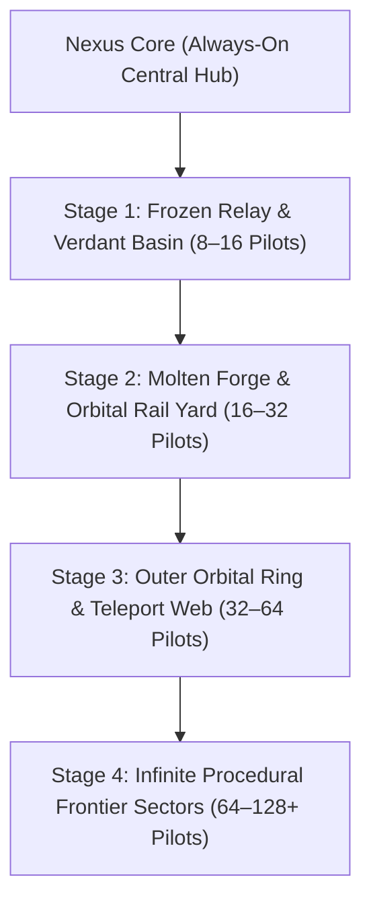
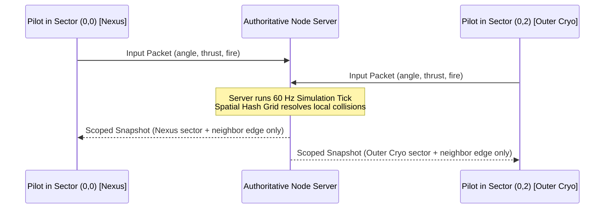

# Infinite Confluence V2: 64–128+ Pilot Scaling & Continuous Procedural Generation

This design specification upgrades Saucer Jam from a fixed four-district arena to an **infinitely expanding procedural orbital megastructure** engineered to host **64 to 128+ concurrent pilots** at 60 Hz.

---

## 1. Visual Concepts & Architecture Overviews

````carousel

<!-- slide -->

<!-- slide -->

````

---

## 2. Core Pillars of the Infinite Expansion Model



### A. Dynamic Population-Driven Unfolding
* **Low Population (1–4 Players):** The arena stays bounded to the central **Nexus Core** so pilots never wander through empty void.
* **Medium Scale (8–32 Players):** The primary biomes (**Frozen Relay**, **Verdant Basin**, **Industrial Forge**, **Orbital Rail Yard**) unlock radially via automated lockdown gates.
* **Massive Scale (64–128+ Players):** The world begins procedurally generating **modular frontier sectors** outward along cardinal conduit corridors, linked by quantum jump gates and high-speed mag-rails.

---

## 3. The Continuous Procedural Sector Engine

Instead of relying on a single static map file, the server instantiates a **modular spatial grid**:

```
                  [ Sector (0, 2): Deep Cryo Shelf ]
                                  |
[ Sector (-1, 1): Smelter ] - [ Sector (0, 1): Frozen Relay ] - [ Sector (1, 1): Hydroponics ]
            |                             |                             |
[ Sector (-1, 0): Forge ]  -   [ Sector (0, 0): NEXUS CORE ]   - [ Sector (1, 0): Verdant Basin ]
            |                             |                             |
[ Sector (-1,-1): Foundry ] - [ Sector (0,-1): Rail Yard ]    - [ Sector (1,-1): Solar Array ]
                                  |
                  [ Sector (0,-2): Vacuum Horizon ]
```

### Deterministic Sector Generation Rules
1. **Seed-Based Coordination:** The server assigns a single match seed. Both Node.js simulation and browser WebGL renderers use seeded PRNG (`splitmix32` / `xoshiro128**`) so obstacle positions, conveyor belts, and ice fields match with zero network transmission overhead.
2. **Standardized Anchor Interfaces:** Every $64 \times 64$ unit sector has identical doorway/bridge sockets on North, South, East, and West faces, guaranteeing that any newly generated district connects seamlessly to its neighbors.
3. **Biome Weighting:**
   * **Industrial (Westward):** Spawns molten channels, moving conveyor lanes ($\pm 4.5\text{ u/s}$), and dense steel pillar cover.
   * **Cryo / Ice (Northward):** Spawns low-friction ice fields (friction coefficient $0.12$), high-speed slide corridors, and crystalline obstacle pillars.
   * **Verdant / Organic (Eastward):** Spawns circular biodomes, water splash deceleration zones, and organic curving cover.
   * **Orbital Rail / Void (Southward):** Spawns magnetic acceleration rails ($+8.0\text{ u/s}$ impulse), deep-space void hazard drops, and paired quantum portals.

---

## 4. Networking & Server Architecture for 128+ Pilots

Scaling authoritative real-time combat at 60 Hz to 128+ players requires strict network isolation to prevent saturating client bandwidth:



1. **Spatial Hashing & Interest Management:**
   * Ships only receive full 60 Hz physics packets for entities within their local sector and adjacent border zones ($r \le 45\text{ units}$).
   * Distant dogfights ($r > 100\text{ units}$) are compressed into a low-frequency $2\text{ Hz}$ macro radar telemetry feed.
2. **Binary Delta Compression:**
   * Replace JSON state payloads with packed `ArrayBuffer` structs for entity coordinates and headings:
     * Position ($x, z$): 16-bit unsigned ints scaled to arena bounds.
     * Angle: 8-bit unsigned int ($0\text{ to }255 \implies 0\text{ to }2\pi$).
     * Velocity ($v_x, v_z$): 8-bit signed ints.
   * Keeps bandwidth under **$18\text{ KB/s}$ per client**, enabling smooth gameplay even on mobile 5G/LTE connections.

---

## 5. Client Rendering & Asset Integration (Three.js + Blender MCP)

To handle 128+ detailed saucers and sprawling modular sectors in WebGL:

1. **GPU Instanced Meshes (`THREE.InstancedMesh`):**
   * All common modular props (corridor walls, conveyor rollers, blast doors, light stanchions) use single draw-call instancing.
   * Saucer hulls use instanced rendering with per-instance team color and damage matrix uniforms.
2. **Frustum & Occlusion Culling:**
   * Sectors obscured behind blast doors or outside the camera's tactical frustum are automatically detached from the render tree.
3. **Blender MCP Production Pipeline:**
   * AI agents generate modular $16\times16$ unit wall/conveyor tile `.glb` assets via Blender's Python MCP tools.
   * Ships use LOD (Level-of-Detail): LOD0 (high-poly, custom decals) for local/close ships, LOD1 (simplified aerodynamic hull) for distant fleet skirmishes.
