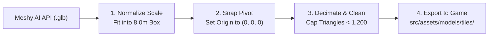

# Meshy AI Modular Arena Tiles: Programmatic Blueprint & Pipeline

This specification provides the exact dimensions, physics metadata, Meshy AI prompts, and automated post-processing pipeline needed for AI agents to generate and assemble modular 3D arena tiles for **Saucer Jam**.

---

## 1. The Dimensional Standard (Three.js & Simulation)

In Saucer Jam, the top-down game plane is **$X$ (width)** and **$Z$ (depth)**, with **$Y$ (height)** pointing up into the camera.

```
       -Z (North Socket)
           ^
           |
-X <-------+-------> +X (East Socket)
(West)     |
           v
       +Z (South Socket)
```

### Global Tile Rules
* **Tile Footprint:** Exactly **$8.0\text{ m} \times 8.0\text{ m}$** on the $X/Z$ plane (bounds: $[-4.0, +4.0]$).
* **Floor Level ($Y=0$):** All floor decks sit between $Y = 0.0$ and $Y = 0.2\text{ m}$.
* **Pivot / Origin:** Always centered at **$[0, 0, 0]$** on the floor plane.
* **Wall Height:** Walls rise from $Y = 0.0$ to $Y = 3.5\text{ m}$ (tall enough so saucers cannot clip through; lasers bounce off cleanly).
* **Socket Snap Points:**
  * `North`: $(0.0, 0.0, -4.0)$
  * `South`: $(0.0, 0.0, +4.0)$
  * `East`:  $(+4.0, 0.0, 0.0)$
  * `West`:  $(-4.0, 0.0, 0.0)$

---

## 2. The 8 Core Tiles: Dimensional & Prompt Matrix

| Tile ID | Category | Collision Type | Exact Bounding Box ($W \times H \times D$) | Physics / Surface Properties |
| :--- | :--- | :--- | :--- | :--- |
| `floor_deck_standard` | Floor | `none` | $8.0\text{m} \times 0.2\text{m} \times 8.0\text{m}$ | Standard friction: $1.0$ |
| `floor_conveyor_lane` | Floor | `none` | $8.0\text{m} \times 0.25\text{m} \times 8.0\text{m}$ | Carry velocity: $+4.5\text{ m/s}$ along $+Z$ |
| `floor_ice_drift` | Floor | `none` | $8.0\text{m} \times 0.15\text{m} \times 8.0\text{m}$ | Low friction: $0.12$ (drift mechanics) |
| `wall_straight_barrier` | Barrier | `box` | $8.0\text{m} \times 3.5\text{m} \times 1.2\text{m}$ | Reflective bounce surface; $100\%$ opaque |
| `wall_corner_90` | Barrier | `l_shape` | $8.0\text{m} \times 3.5\text{m} \times 8.0\text{m}$ | Outer $90^\circ$ elbow; thickness $1.2\text{m}$ |
| `prop_blast_pillar` | Obstacle | `circle` | $2.8\text{m} \times 4.0\text{m} \times 2.8\text{m}$ | Radius $1.4\text{m}$; center cover |
| `prop_reactor_bloom` | Objective | `trigger` | $3.2\text{m} \times 2.2\text{m} \times 3.2\text{m}$ | Pickup trigger ($r=1.6\text{m}$); timed respawn |
| `prop_quantum_portal` | Traversal | `trigger` | $4.5\text{m} \times 5.0\text{m} \times 2.0\text{m}$ | Teleport trigger ($r=1.2\text{m}$); paired transit |

---

## 3. Tuned Meshy AI Prompts

When prompting 3D generative models like Meshy AI, modular tiles require **flat bottom constraints** and **clean orthogonal silhouettes** to prevent messy warped edges.

### 1. Standard Floor Deck (`floor_deck_standard`)
> **Prompt:** `A game-ready modular sci-fi floor deck tile, 3D asset, perfectly square flat base, heavy dark metallic panel plating, subtle technical grid panel lines, inset glowing cyan light conduits, industrial ventilation grating, low poly hard surface, PBR textures, clean straight edges, top-down game asset`

### 2. Industrial Conveyor Lane (`floor_conveyor_lane`)
> **Prompt:** `A modular sci-fi factory conveyor belt floor tile, perfectly square flat base, industrial steel frame with yellow and black caution hazard stripes along borders, dark metallic conveyor rollers down the center, subtle glowing orange status indicators, hard surface game asset, clean straight edges, top-down perspective`

### 3. Cryo Ice Drift Tile (`floor_ice_drift`)
> **Prompt:** `A modular sci-fi icy floor tile, perfectly square flat base, frosted crystalline ice surface with subtle cracks, frozen coolant plates beneath translucent blue ice, industrial cybernetic border trim, hard surface sci-fi game asset, top-down perspective`

### 4. Straight Barrier Wall (`wall_straight_barrier`)
> **Prompt:** `A modular sci-fi fortress barrier wall segment mounted on a narrow rectangular base, heavy reinforced dark steel armor plates, vertical structural support ribs, bright glowing blue neon conduit stripe running horizontally, beveled hard-surface edges, game asset, low poly, PBR`

### 5. 90-Degree Corner Wall (`wall_corner_90`)
> **Prompt:** `A modular 90-degree corner sci-fi wall barrier, L-shaped reinforced defensive wall on a square base, heavy dark carbon plating, glowing cyan conduit trim along the outer corner, industrial sci-fi aesthetic, clean hard surface geometry, game asset`

### 6. Blast Pillar Cover (`prop_blast_pillar`)
> **Prompt:** `A heavy sci-fi structural arena pillar obstacle, hexagonal vertical column, reinforced dark titanium plating, hazard warning chevrons, hydraulic dampeners at top and bottom, central glowing cyan energy core, standalone modular game prop, PBR`

### 7. Reactor Bloom Objective Pedestal (`prop_reactor_bloom`)
> **Prompt:** `A futuristic sci-fi reactor core bloom pedestal, circular mechanical floor base with glowing green nanotech generator coils, floating pulsating holographic energy sphere in the center, health pickup beacon, high-tech cybernetic arena prop, game asset`

### 8. Quantum Portal Arch (`prop_quantum_portal`)
> **Prompt:** `An upright circular sci-fi stargate portal archway on a heavy mechanical pedestal, metallic ring lined with glowing blue glyph emitters, swirling glowing golden warp vortex inside the ring, teleporter game prop, low poly hard surface, PBR`

---

## 4. Automated Agent Ingestion Pipeline

Meshy AI outputs raw `.glb` files with arbitrary scales and off-center pivots. An automated agent script (using headless Blender or Three.js node scripts) normalizes them with these 4 steps:



### Headless Blender Normalization Script (`scripts/normalize_tile.py`)
Agents run this via command line or Blender MCP:

```python
import bpy
import sys
import os

def normalize_tile(input_glb, output_glb, target_w=8.0, target_d=8.0, target_h=3.5, is_floor=False):
    # Clear existing scene
    bpy.ops.wm.read_factory_settings(use_empty=True)
    bpy.ops.import_scene.gltf(filepath=input_glb)
    
    # Select all imported meshes and join into a single mesh
    meshes = [obj for obj in bpy.context.scene.objects if obj.type == 'MESH']
    bpy.context.view_layer.objects.active = meshes[0]
    for obj in meshes:
        obj.select_set(True)
    bpy.ops.object.join()
    tile = bpy.context.active_object

    # 1. Align origin to bottom-center
    bpy.ops.object.origin_set(type='ORIGIN_GEOMETRY', center='BOUNDS')
    bbox = [tile.matrix_world @ Vector(corner) for corner in tile.bound_box]
    min_z = min(v.z for v in bbox) # In Blender Z is up
    tile.location.z -= min_z
    tile.location.x = 0
    tile.location.y = 0
    bpy.ops.object.transform_apply(location=True, rotation=True, scale=True)

    # 2. Rescale to exact metric dimensions
    dim = tile.dimensions
    if is_floor:
        scale_x = target_w / dim.x
        scale_y = target_d / dim.y
        scale_z = min(scale_x, scale_y) # preserve floor proportion
    else:
        scale_x = target_w / dim.x
        scale_y = target_w / dim.y
        scale_z = target_h / dim.z
    tile.scale = (scale_x, scale_y, scale_z)
    bpy.ops.object.transform_apply(scale=True)

    # 3. Export clean glTF Binary (.glb)
    bpy.ops.export_scene.gltf(filepath=output_glb, export_format='GLB')
    print(f"Successfully normalized {output_glb}")
```

---

## 5. Machine-Readable Tile Manifest (`tiles.json`)

Your game logic (`shared/simulation.js`) and 3D renderer (`src/world/World.js`) load this single manifest to procedurally build sectors:

```json
{
  "version": "1.0.0",
  "tileGridSize": 8.0,
  "tiles": {
    "floor_deck_standard": {
      "model": "/assets/models/tiles/floor_deck_standard.glb",
      "category": "floor",
      "collision": null,
      "friction": 1.0,
      "sockets": { "N": "deck", "S": "deck", "E": "deck", "W": "deck" }
    },
    "floor_conveyor_lane": {
      "model": "/assets/models/tiles/floor_conveyor_lane.glb",
      "category": "floor",
      "collision": null,
      "friction": 1.0,
      "carryVector": { "x": 0.0, "z": 4.5 },
      "sockets": { "N": "conveyor", "S": "conveyor", "E": "deck", "W": "deck" }
    },
    "floor_ice_drift": {
      "model": "/assets/models/tiles/floor_ice_drift.glb",
      "category": "floor",
      "collision": null,
      "friction": 0.12,
      "sockets": { "N": "ice", "S": "ice", "E": "ice", "W": "ice" }
    },
    "wall_straight_barrier": {
      "model": "/assets/models/tiles/wall_straight_barrier.glb",
      "category": "barrier",
      "collision": { "type": "box", "w": 8.0, "d": 1.2, "h": 3.5 },
      "sockets": { "N": "solid", "S": "solid", "E": "wall_joint", "W": "wall_joint" }
    },
    "wall_corner_90": {
      "model": "/assets/models/tiles/wall_corner_90.glb",
      "category": "barrier",
      "collision": { "type": "box", "w": 8.0, "d": 8.0, "h": 3.5 },
      "sockets": { "N": "solid", "S": "wall_joint", "E": "solid", "W": "wall_joint" }
    },
    "prop_blast_pillar": {
      "model": "/assets/models/tiles/prop_blast_pillar.glb",
      "category": "obstacle",
      "collision": { "type": "circle", "radius": 1.4 },
      "sockets": { "N": "deck", "S": "deck", "E": "deck", "W": "deck" }
    },
    "prop_reactor_bloom": {
      "model": "/assets/models/tiles/prop_reactor_bloom.glb",
      "category": "objective",
      "trigger": { "type": "bloom", "radius": 1.6, "respawnSec": 15 },
      "sockets": { "N": "deck", "S": "deck", "E": "deck", "W": "deck" }
    },
    "prop_quantum_portal": {
      "model": "/assets/models/tiles/prop_quantum_portal.glb",
      "category": "traversal",
      "trigger": { "type": "portal", "radius": 1.2 },
      "sockets": { "N": "deck", "S": "deck", "E": "deck", "W": "deck" }
    }
  }
}
```

---

## 6. How the Procedural Generator Assembles Infinite Sectors

1. **Chunk Coordinate Grid:** Each chunk is an $8 \times 8$ grid of tiles ($64\text{m} \times 64\text{m}$ total size).
2. **Socket Matching:** The generator ensures edge compatibility (e.g. `conveyor` connects to `conveyor`, `wall_joint` connects to `wall_joint`, and open `deck` connects to open `deck`).
3. **Collision Registration:** When a chunk is instantiated, the server automatically reads the `collision` field from `tiles.json` and inserts the bounding box or circle directly into the 60 Hz physics collision tree.
4. **Zero Hand-Crafting:** The system continuously expands chunk by chunk as player population grows, maintaining identical physics and graphics everywhere.
