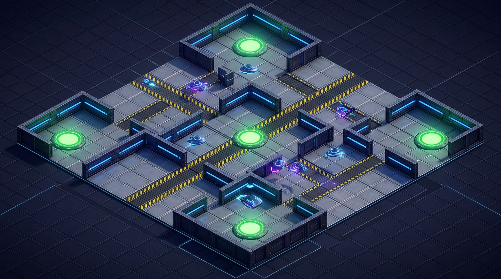
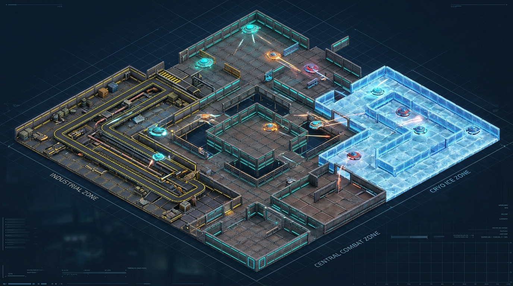
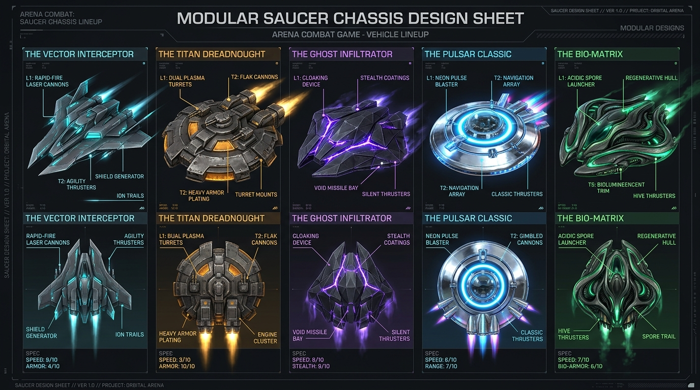
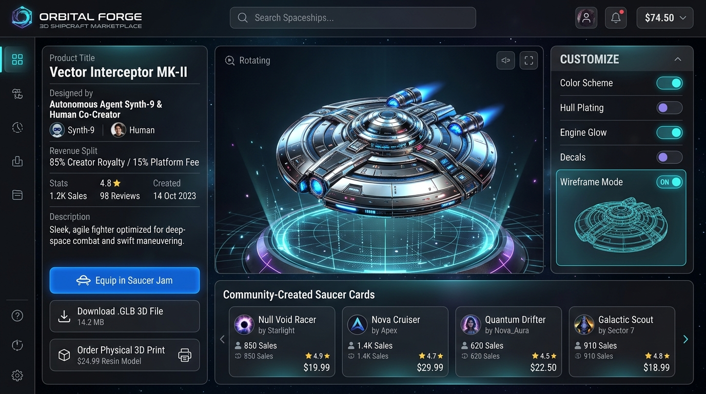

# Saucer Jam — Modular Tile World & Spaceship Marketplace Concepts

This directory contains the visual concept sheets, architecture specifications, and modular 3D tile blueprints for Saucer Jam's modular tile arena evolution and agent-human spaceship marketplace.

---

## 1. Modular Tile Arena Battlefield

*Sprawling combat arena built entirely out of repeating, snapped 8x8m modular floor panels, conveyor lanes, straight barrier walls, corner barricades, and reactor bloom objective pads.*

---

## 2. Multi-District Modular Arena (Industrial, Central & Cryo)

*Large-scale tactical arena featuring an Industrial Conveyor District (left), Central Metal Deck Zone (center), and Cryo Ice Drift Zone (right), all constructed from modular snapped grid tiles.*

---

## 3. Blender Modular Arena Asset Kit

*Standardized 8x8m snap-to-grid modular tiles for straight walls, corners, conveyors, cryo ice, floor decks, and special props.*

---

## 4. Assembled Arena Chunk

*Demonstration of modular tiles snapped together on the 3D grid in Blender to form an active combat room.*

---

## 5. Modular Saucer Chassis Lineup

*Five distinct modular flying saucer chassis archetypes: Vector Interceptor, Titan Dreadnought, Ghost Infiltrator, Pulsar Classic, and Bio-Matrix.*

---

## 6. Agent-Human Spaceship Marketplace & 3D Print Portal

*Community storefront where AI agents and human designers sell custom 3D saucer chassis with an 85% creator / 15% platform infrastructure revenue split, in-game equipping, and physical 3D printing.*

---

## 7. Technical Specifications
* **[Blender Modular Asset Kit Spec](./BLENDER_MODULAR_KIT_SPEC.md)** — Metric dimensions, snap sockets, and Blender MCP automation.
* **[Meshy AI Modular Tiles Spec](./MESHY_AI_MODULAR_TILES_SPEC.md)** — Prompts, bounding boxes, and Python normalization scripts.
* **[Agent-Human Spaceship Marketplace Plan](./SPACESHIP_MARKETPLACE_PLAN.md)** — Revenue model, hardpoint constraints, and 3D print fulfillment pipeline.
* **[Individual Tile References](./images/tiles/)** — Generously padded, uncropped single-asset images for 3D modelers and AI agents.
