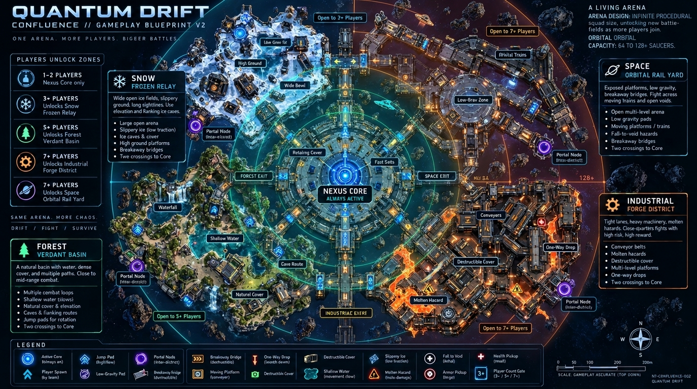
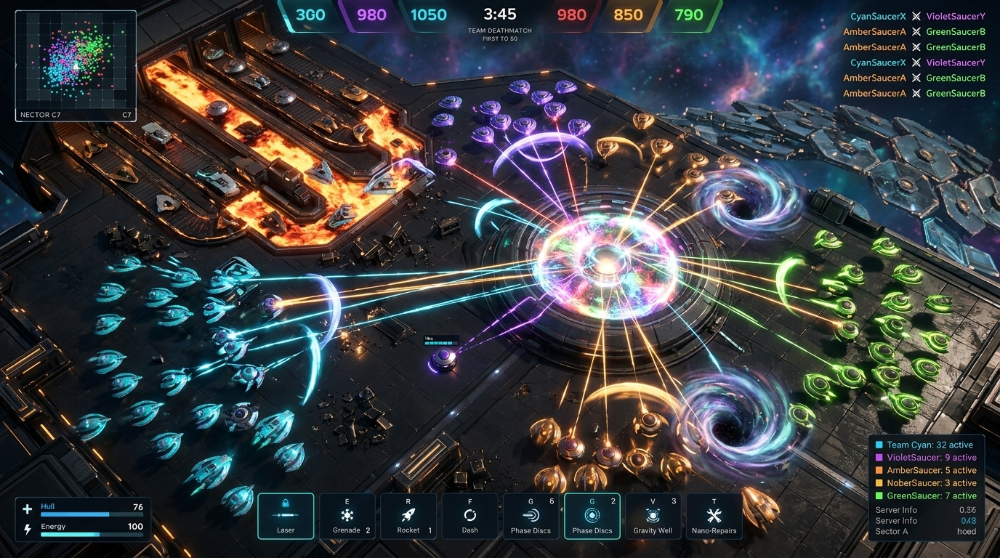
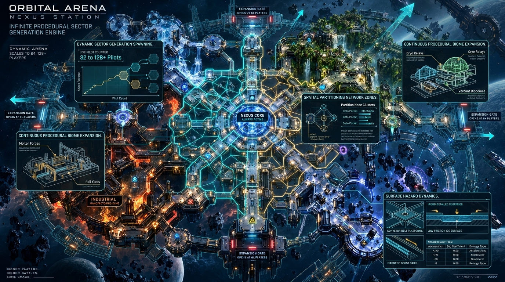
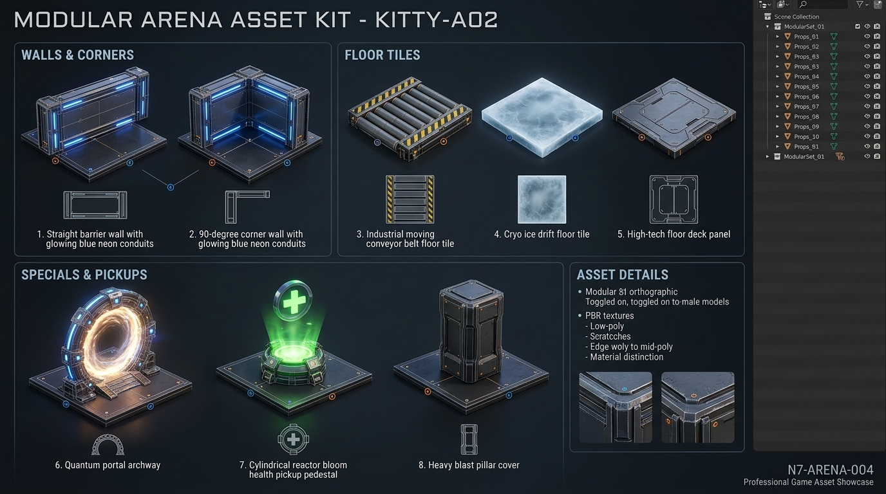
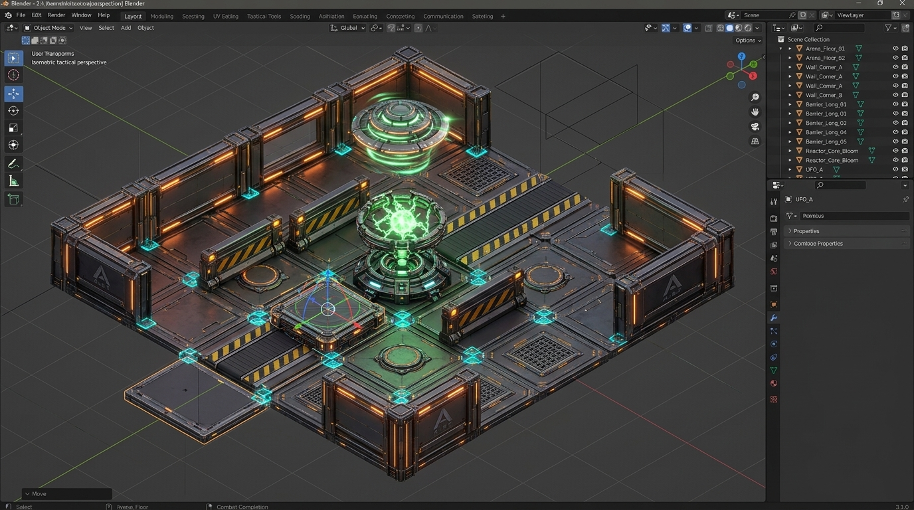

# Saucer Jam — Confluence V2 & Infinite World Concepts

This directory contains the visual concept sheets, architecture specifications, and modular 3D tile blueprints for Saucer Jam's Confluence V2 evolution, designed for 64–128+ concurrent pilots and continuous procedural arena generation.

---

## 1. Infinite Arena Macro Blueprint

*Radial district unfolding from the central Nexus Core into infinite procedural frontier sectors.*

---

## 2. Fleet Combat Showdown (64–128+ Pilots)

*Tactical top-down combat across multiple sectors featuring lasers, phase discs, gravity wells, and moving conveyor flanks.*

---

## 3. Infinite Procedural Sector Generation Engine

*Systems architecture detailing seed-based deterministic sector generation, spatial partitioning, and surface hazards.*

---

## 4. Blender Modular Arena Asset Kit

*Standardized 8x8m snap-to-grid modular tiles for straight walls, corners, conveyors, cryo ice, floor decks, and special props.*

---

## 5. Assembled Arena Chunk

*Demonstration of modular tiles snapped together on the 3D grid in Blender to form an active combat room.*

---

## 6. Detailed Technical Specifications
* **[Infinite Confluence V2 Architecture Plan](./INFINITE_CONFLUENCE_V2_PLAN.md)** — Spatial sharding, delta compression, and network budget.
* **[Blender Modular Asset Kit Spec](./BLENDER_MODULAR_KIT_SPEC.md)** — Metric dimensions, snap sockets, and Blender MCP automation.
* **[Meshy AI Modular Tiles Spec](./MESHY_AI_MODULAR_TILES_SPEC.md)** — Prompts, bounding boxes, and Python normalization scripts.
* **[Individual Tile References](./images/tiles/)** — Pre-cropped single-asset images for 3D modelers and AI agents.
