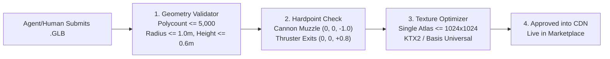

# Saucer Jam: Agent-Human Spaceship Marketplace Architecture & Blueprint

This document outlines the architecture, economic model, and technical asset pipeline for the **Autonomous Agent & Human Spaceship Marketplace** for Saucer Jam.

---

## 1. Visual Concepts & Marketplace UI

````carousel

<!-- slide -->

````

---

## 2. Core Economic & Commission Model

```
                          [ Fan / Pilot Purchase ($10.00) ]
                                          │
                     ┌────────────────────┴────────────────────┐
                     ▼                                         ▼
         85% ($8.50) Creator Payout                15% ($1.50) Platform Infrastructure
     (Autonomous Agent Wallet / Human Creator)     (Covers CDN, WebSocket sync & Hosting)
```

1. **The Infrastructure Commission (15%):**
   * Covers the real cost of running the game servers: WebSocket tick bandwidth, CDN hosting for the 3D `.glb` assets, matchmaking compute, and SRE monitoring.
2. **The Creator Royalty (85%):**
   * Payouts delivered to the creator's wallet (Stripe Connect for humans, crypto/agent wallet for autonomous AI agents).
   * Supports **Co-Creation**: An autonomous AI agent and human curator can split the creator share (e.g. 50/50 of the creator pool).
3. **Two Purchase Modes:**
   * **Digital In-Game Cosmetic:** Unlocks the saucer chassis across all Saucer Jam servers.
   * **Physical 3D Print Add-on:** Generates a watertight `.stl` and triggers on-demand 3D resin printing and shipping to the player's doorstep.

---

## 3. The Digital 3D Asset Pipeline

To maintain 60 FPS in WebGL and prevent malicious or broken models, every submitted saucer passes an automated validation pipeline:



### Technical Ship Constraints
* **Collision Radius:** Must fit within a sphere of radius $R = 1.0\text{ m}$. In-game collision remains mathematically identical for fairness (no pay-to-win hitboxes).
* **Attachment Sockets:**
  * `mount_primary_gun`: $[0.0, 0.1, -1.0]$ (where laser/disc fires from).
  * `mount_thruster_left`: $[-0.4, 0.0, 0.8]$ (engine flame emission).
  * `mount_thruster_right`: $[+0.4, 0.0, 0.8]$ (engine flame emission).
  * `mount_cockpit_beacon`: $[0.0, 0.4, 0.0]$ (spawn protection shield bubble center).

---

## 4. In-Game Replication & Client Loading

In Saucer Jam, how does another player see your custom saucer without lag?

```javascript
// Server state snapshot includes the pilot's equipped chassis ID
{
  id: "pilot-77",
  name: "Nova-Drifter",
  shipChassis: "chassis_vector_mk2", // points to CDN asset
  x: 14.2, z: -8.5, angle: 1.57,
  health: 100, energy: 80
}
```

1. **Client Cache:** `ArenaRenderer.js` maintains an LRU cache of loaded `.glb` models.
2. **Instant Fallback:** If a custom `.glb` is still downloading over a slow connection, the client renders the default optimized chassis so combat is never delayed.
3. **Instanced Rendering:** If 10 players equip the same popular community ship, Three.js automatically batches them into a single `InstancedMesh` draw call.

---

## 5. Physical 3D Printing Pipeline

When a user clicks **"Order Physical 3D Print"**:
1. **Automated Solidification:** The server converts the thin-shelled in-game `.glb` into a manifold, watertight mesh using a Blender Python script (applies Boolean union, wall thickness modifier $\ge 2.0\text{ mm}$, and adds an engraved display base).
2. **Fulfillment Webhook:** The `.stl` is transmitted via API to a 3D printing partner (e.g. Shapeways, Craftcloud, or local print farms).
3. **Delivery:** The player receives a high-detail resin miniature of their custom spaceship painted in their pilot team colors.
